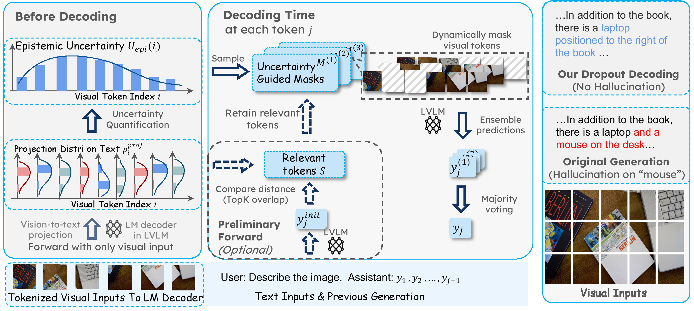

# From Uncertainty to Trust: Enhancing Reliability in Vision-Language Models with Uncertainty-Guided Dropout Decoding

## Overview

</p>
Large vision-language models (LVLMs) demonstrate remarkable capabilities in multimodal tasks but are prone to misinterpreting visual inputs, often resulting in hallucinations and unreliable outputs.
To address these challenges, we propose ***Dropout Decoding***, a novel inference-time approach that quantifies the uncertainty of visual tokens and selectively masks uncertain tokens to improve decoding.
Our method measures the uncertainty of each visual token by projecting it onto the text token space and decomposes it into aleatoric and epistemic components. We focus on epistemic uncertainty, as it captures perception-related errors more effectively.
Inspired by dropout regularization, we introduce uncertainty-guided token dropout, which applies the dropout principle to input visual tokens instead of model parameters, and during inference rather than training.
By aggregating predictions from an ensemble of masked decoding contexts, ***Dropout Decoding*** robustly mitigates errors arising from visual token misinterpretations.
Evaluations on benchmarks such as CHAIR, THRONE, and MMBench demonstrate that ***Dropout Decoding*** significantly reduces object hallucinations (OH) and enhances the reliability and quality of LVLM outputs across diverse visual contexts.

## Setup

to setup the environment, execute the following command:

```bash
conda env create -f environment.yml
conda activate dropout_decoding
```
## Evaluation

### Chair

to run evaluations for chair, we should first prepare the dataset(we use COCO 2014 for test and validation). Please download [here](https://cocodataset.org/#home) and extract it in your data path.

your data should be formed as the following:

```plain
xxx/COCO
├── annotations
├── train2014
└── val2014
```

After preparing dataset, you may have to prepare model checkpoints for models

- **Llava-1.5** you can specify the model-path as `llava-hf/llava-1.5-7b-hf`, or download to local directory 
- **Instructblip** you can specify the model-path as `Salesforce/instructblip-vicuna-7b`, or download to local directory 
- **Llava-next** you can specify the model-path as `llava-hf/llava-v1.6-mistral-7b-hf`, or download to local directory

#### arguments

| Argument           | Type | Default      | Required | Description                                                  |
| ------------------ | ---- | ------------ | -------- | ------------------------------------------------------------ |
| --method           | str  | "None"       | No       | The name for storing results.                                |
| --use-prev-sample  | str  | None         | No       | Whether to use the previous sample. If not provided, a new sample will be created. Default is None. |
| --seed             | int  | None         | No       | Random seed for generating a new sample if use-prev-sample is not set. |
| --original         | bool | False        | No       | Specifies if the generation should use the original method without modifications. |
| --sample-save-name | str  | "sample.log" | No       | Path to save the sample file. Can be used either to save a new sample or to read an existing one. Default is sample.log. |
| --image-numbers    | int  | 500          | No       | Number of images to test on.                                 |
| --gpu-id           | int  | 0            | No       | GPU ID to use during execution. Default is 0.                |
| --model            | str  | "llava-1.5"  | No       | Model to test on. Options: llava-1.5, instructblip, llava-next. Default is llava-1.5. |
| --coco-data-dir    | str  | None         | Yes      | Directory path for the COCO dataset, as mentioned above      |
| --model-path       | str  | None         | Yes      | Path to the model file, as mentioned above                   |

then, you can run like:

```bash
python -m chair_test.chair_test --method test --coco-data-dir xxx/COCO --model-path llava-hf/llava-1.5-7b-hf --sample-save-name test.log --model llava-1.5
```

to run the test (the running dir should be the project's base dir)

### throne

the throne method also uses free-end generation for results, so you can use `utils/chair2throne.py` to turn chair output results into throne ones